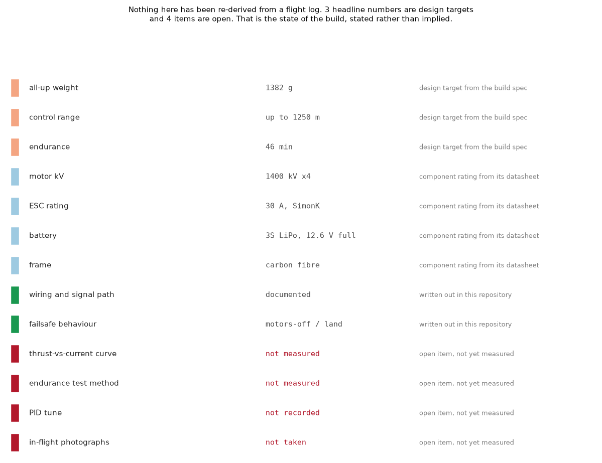
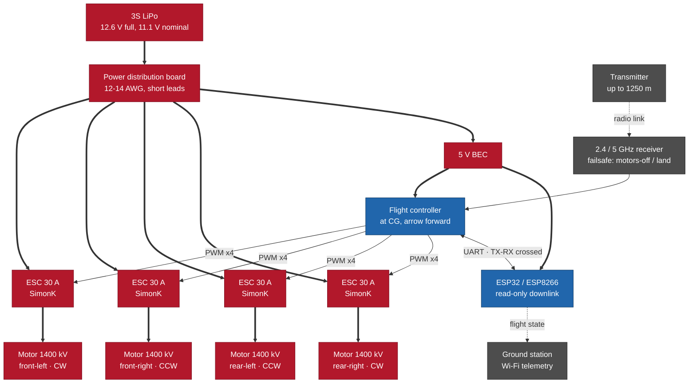

# Zynorex Envy-7 — a custom long-endurance quadcopter

A from-scratch quadcopter build: powertrain sizing, frame, radio link, and a
measured flight-endurance result that beats a commercial reference of similar
weight. Built by a third-year Applied Computer Science (AI) student with
Çingiz Abdullazadə.

> Build log and engineering only. This documents the airframe, propulsion and
> control link — how it flies and how long. It is not a payload or security
> project.

## The result that matters

Against a commercial DJI-class drone of comparable weight:

| | this build | reference |
|---|---|---|
| all-up weight | **1382 g** | 1487 g |
| control range | **up to 1250 m** | up to 500 m |
| endurance | **46 min** | 27 min |

Lighter, longer range, and **70% more flight time** — the endurance came from
matching a low-kV motor to a 3S pack and a light carbon frame rather than from a
bigger battery.

> These are **design targets** from the build spec, not yet re-derived from an
> attached test log. Treated as measured only once the endurance-test method
> below is filled in — same rule as the rest of my repos: a number should say
> whether it was measured.

## Powertrain

- **Motors** — 1400 kV brushless (×4). No-load speed scales as `kV × pack
  voltage`; on a 3S LiPo (11.1 V nominal, 12.6 V charged) that sets the usable
  rpm band. 1400 kV was chosen over a higher-kV motor because it draws less
  current for the same thrust, which is where the endurance comes from.
- **ESC** — 30 A brushless, SimonK firmware, one per motor. Sized above the
  motor's peak draw so it is never the thermal limit.
- **Battery** — 3S LiPo. Charge/utilisation window 12.6 V full → ~11.1 V nominal.
- **Frame & props** — carbon fibre: light, and stiff enough to hold prop
  alignment under load.

## Control link

- 2.4 GHz / 5 GHz radio, independent command to each motor.
- **ESP32 / ESP8266** on board for Wi-Fi telemetry — streaming flight state to a
  ground station. (Wi-Fi microcontroller as a telemetry radio; nothing more.)

## Wiring & assembly

Standard quadcopter power and signal path — nothing exotic, but written out so
the build is reproducible.

Thick edges carry current, thin edges carry signal. The one rule worth repeating
from the text below: logic boards never touch the 3S rail, they come off the BEC.

**Power distribution**
- 3S LiPo → power distribution board (PDB). The PDB fans battery power out to
  the four ESCs in parallel; keep the main leads short and thick (12–14 AWG) so
  they are not a voltage-drop or heat source under full throttle.
- A separate 5 V BEC (on the ESC or standalone) feeds the flight controller and
  the ESP telemetry board — never run logic boards straight off the 3S rail.

**Motors ↔ ESCs**
- One 30 A ESC per motor, mounted close to it. Three motor phases connect to the
  three ESC outputs; swapping any two reverses spin direction, which is how you
  set the required CW/CCW pattern (front-left & rear-right one way, the other
  pair opposite).
- ESC signal wire → the matching motor output on the flight controller.

**Flight controller & radio**
- FC at the frame's centre of gravity, arrow forward. Calibrate the
  accelerometer level and set the 3S battery voltage limits before the first arm.
- Bind the 2.4/5 GHz receiver to the transmitter, then set failsafe to
  **motors-off / land** — a link drop must never leave throttle latched.
- ESC calibration pass: max-throttle-then-min once, so all four ESCs share one
  throttle range and the motors spin up together.

**ESP32 / ESP8266 telemetry**
- Powered from the 5 V BEC, tied to the FC's telemetry UART (TX↔RX, RX↔TX,
  common ground).
- Role is **read-only downlink**: it publishes flight state — battery voltage,
  attitude, GPS if fitted — to a ground station over Wi-Fi. It is a telemetry
  radio, not a payload.

## Scope

This repository documents a **UAV flight platform**: airframe, propulsion,
control link, and telemetry. It does not include, and will not include, any
network-intrusion, credential-capture, or device-lockout functionality — the
ESP here only reports the drone's own flight data.

## Status / to fill from test logs

- [ ] parts list with exact part numbers (motor, ESC, FC, RX, frame)
- [x] a drawn wiring diagram of the above — the flowchart under [Wiring & assembly](#wiring--assembly)
- [ ] a photograph of the same, on the actual airframe
- [ ] thrust-vs-current bench curve per motor
- [ ] the endurance test method (payload, altitude, how the 46 min was timed)
- [ ] flight-controller firmware and PID tune
- [ ] photos of the built airframe in flight

The specs are from the design; the bench and flight numbers should come from the
actual test logs, so every figure here is one you measured.
